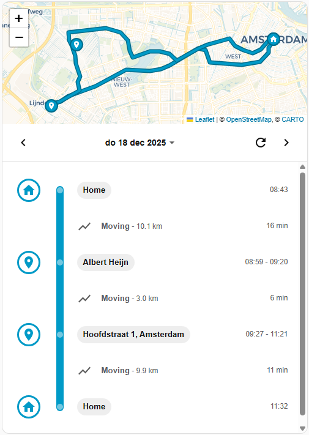

# Location Timeline Card (Home Assistant)

Location Timeline Card is a custom Lovelace card that builds a **timeline–style day view** from your Home Assistant location history. It turns raw GPS points into an easy-to-read daily story of where a person/device stayed and when they moved.

## What this card does

- Reads location history from a `device_tracker` or `person` entity
- Groups points into **stays** and **moves** using configurable thresholds
- Shows zone names when points are inside Home Assistant `zone.*` entities
- Supports reverse geocoding for stays outside zones
- Keeps a per-day in-memory cache for snappy day-to-day navigation
- Runs fully in the frontend (no extra backend integration required)

## Installation (HACS)
1. Open **HACS → Frontend → ⋮ → Custom repositories**.
2. Add this repository URL.
3. Set category to **Dashboard**.
4. Click **Add**.
5. Find **Location Timeline Card** in HACS Frontend and click **Download**.
6. Restart Home Assistant (or reload frontend resources if prompted).

After installation, ensure the card resource is available in Lovelace (HACS normally registers this automatically).

## Usage
Add the card in the Lovelace UI editor or with manual YAML.

### Minimal setup
```yaml
type: custom:location-timeline-card
entity: device_tracker.my_phone
```
The entity must expose latitude/longitude attributes.

## Reverse Geocoding
For stays that are not clearly inside a Home Assistant zone, the card can resolve a human-friendly location name. This process is called **reverse geocoding**: converting latitude/longitude coordinates into an address or place label.

By default, Home Assistant only stores raw GPS coordinates in history. If you want meaningful labels like "Starbucks" or "Main Street 12" instead of just coordinates, you need to configure one of the following options.

1. **Preferred:** configure the [Places integration](https://github.com/custom-components/places) and set `places_entity`.
   - Install the Places integration (via HACS) and configure it for your tracked entity.
   - This integration creates a `sensor.places_*` entity that stores resolved place names.
   - Set the card’s `places_entity` option to that sensor.
   - This is recommended because Places writes location labels into Home Assistant history. That means:
     - Labels are stored persistently.
     - Historic days load instantly without repeated API calls.
     - You get consistent naming over time.
   - Under the hood, Places uses the OpenStreetMap API to resolve coordinates into readable addresses or place names.

2. **Fallback:** configure `osm_api_key` with your **email address**.
   - Set `osm_api_key` to your email address (required by OpenStreetMap Nominatim usage policy).
   - The card will call OSM Nominatim directly from the frontend when no Places label is available.
   - Requests are rate-limited to at most one request per second to stay within OSM guidelines.
   - Responses are cached by the card (including "unknown" results) to avoid repeated lookups.
   - This is especially useful for resolving older historic stays if you have set up the Places entity later.
   - Note: Unlike Places, these labels are not written back into Home Assistant history.

Example:
```yaml
type: custom:location-timeline-card
entity: device_tracker.my_phone
places_entity: sensor.places_my_phone
osm_api_key: me@example.com```

If `osm_api_key` is not set, unresolved stays remain **Unknown location**.

## Configuration options
| Name | Type | Default | Description |
|------|------|---------|-------------|
| `entity` | string | **required** | `device_tracker` or `person` entity to pull GPS history from. |
| `places_entity` | string | `null` | Optional `sensor` from the Places integration used first for reverse geocoding. |
| `osm_api_key` | string | `null` | Optional OSM Nominatim email address (used as API key) for reverse geocoding fallback. |
| `stay_radius_m` | number | `75` | Radius (meters) used to detect a stay. |
| `min_stay_minutes` | number | `10` | Minimum duration (minutes) required to qualify as a stay. |


## Notes
- The card reads raw GPS history from the tracked entity’s latitude/longitude attributes.
- Zone labels are resolved from `zone.*` entities.
- All timeline processing happens in the browser.
